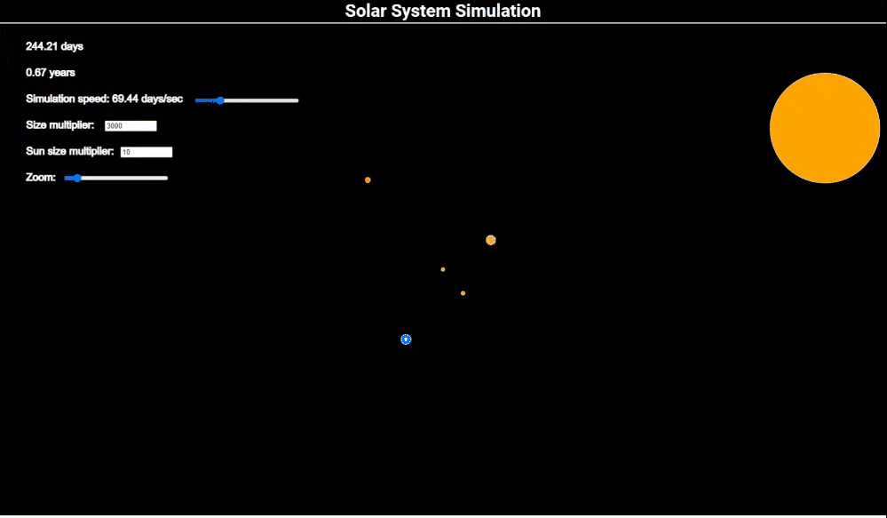

# Solar System Simulation

This project is a simulation of the solar system built using the p5.js library. It visually represents the orbits of planets around the sun, showcasing their relative sizes and distances.

## Features

- Realistic orbital mechanics
- Scalable planet sizes and distances
- Interactive controls to explore the simulation

## Technologies Used

- p5.js
- JavaScript
- HTML/CSS

Enjoy exploring the solar system!

## Demo

